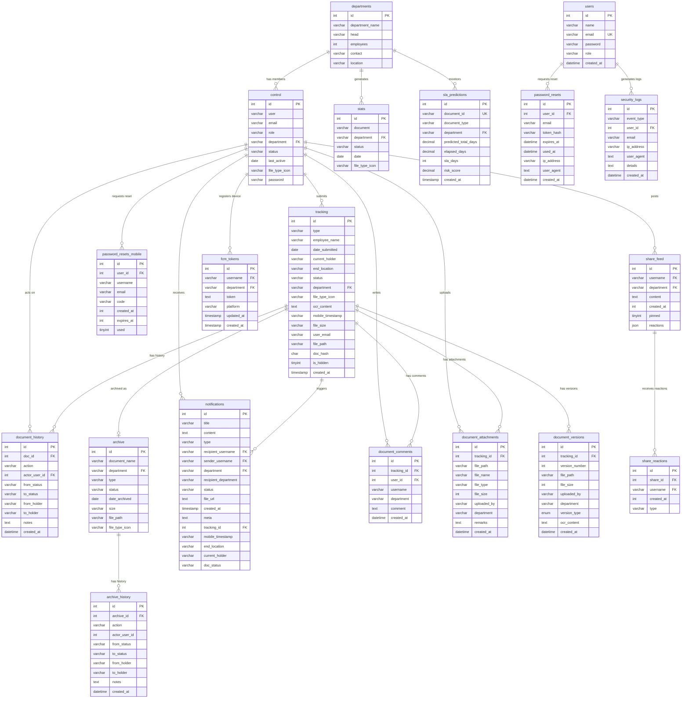

# Entity Relationship Diagram (ERD) — CHRMO Document Tracking System

The Entity Relationship Diagram (ERD) illustrates the database design of the OCR-Based Document Tracking and Archival System by identifying the main entities and their relationships. The ERD serves as a blueprint for structuring data to support document storage, tracking, and retrieval within the system.

The diagram includes core entities such as Control (Users), Tracking (Documents), Departments, Document History, Archive, and Notifications. The Control entity stores information related to system users, including their roles, departments, and account status. The Tracking entity serves as the central document table, containing details about uploaded or scanned files such as document type, date submitted, current status, current holder, and OCR-extracted content. Each tracked document is associated with a department responsible for processing or handling it.

The Document History entity records the movement and status changes of documents as they pass through different departments and personnel, ensuring accountability and transparency. This entity maintains a direct relationship with the Tracking entity, capturing each action — such as create, receive, route, and archive — along with the originating and destination holders. When a document reaches end-of-life, it is moved to the Archive entity, and its full audit trail is preserved in Archive History. The Notifications entity facilitates real-time communication between departments by alerting recipients when documents are routed to them. Additionally, supporting entities such as Document Comments, Document Attachments, and Document Versions enable collaboration, supplementary file uploads, and file revision tracking. Authentication-related entities including Users, Password Resets, and Security Logs handle system access and audit logging, while the Share Feed and Share Reactions entities support social collaboration features among users.

> Copy the Mermaid code block below and paste it into [Mermaid Live Editor](https://mermaid.live) to render the diagram.



## Table Summary

| # | Table | Purpose |
|---|-------|---------|
| 1 | `departments` | Department master list (name, head, location) |
| 2 | `control` | System users / accounts (login, role, department) |
| 3 | `tracking` | **Core** — active document tracking (one row per document) |
| 4 | `document_history` | Audit trail of all actions on a tracked document |
| 5 | `archive` | Completed/archived documents moved from tracking |
| 6 | `archive_history` | Copied history for archived documents |
| 7 | `notifications` | Push/in-app notifications for routing & actions |
| 8 | `document_comments` | User comments on tracked documents |
| 9 | `document_attachments` | File attachments added to tracked documents |
| 10 | `document_versions` | Version history when documents are updated/returned |
| 11 | `stats` | Reporting snapshots for document generation reports |
| 12 | `sla_predictions` | SLA risk predictions per document |
| 13 | `users` | Web admin users (separate from mobile `control` table) |
| 14 | `password_resets` | Web password reset tokens |
| 15 | `password_resets_mobile` | Mobile app password reset codes |
| 16 | `security_logs` | Security event audit log |
| 17 | `share_feed` | Social feed posts between users |
| 18 | `share_reactions` | Reactions (likes) on feed posts |
| 19 | `fcm_tokens` | Firebase Cloud Messaging device tokens |

## Document Lifecycle Flow

```
Create/Upload → Pending → Receive (In Review) → Route (Pending) → ... → Update (Ready for Archive) → Complete → Archive
```
